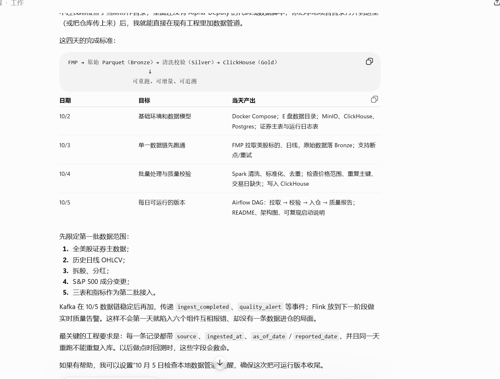

### 数据治理思路

## 工具表

(1)ingestion, 记下每次 FMP 拉取：batch_id、接口、ticker 数、时间、成功/失败 
    batch_id, n_ticker, time, fail_tick_list, rows_fetched, git_verison, report

(2)quality_issues 记录发现什么问题、规则编号、严重程度、涉及哪些 ticker/date 
    issue_id, no_rule, batch_id, ticker, date

(3)quarantine_records 被阻断、不允许进 Gold 的具体记录
    issue_id, batch_id, status(pending/released/dicarded)

(4)data_corrections 记下来最终判定、处理人/规则版本、重跑批次、修复时间。
    issue_id, action(release/discard/refetch/manual_fix), new_batch_id

(5)每张 raw表记下来
batch_id
source_logic_version

(6) 另外每张golden表记下来  

a. data_version记下数据版次（通常都是1，除非大规模重构我们再升级去2）
b, is_current(现在是否在使用),  
c. source_logic_version(版本号，以后如果fmp更改了计算逻辑，我们就改这个参数，方便对历史数据进行审计&回滚)， 
d. batch_id（对应版本拉取数据的批次）
e, quality status(标记 health, warning, danger, 按照数据质量去标记读，读的时候只读health和warning)。 
f, 对于补跑的数据，最好是追加新版，而不是删除旧版重跑。 数据默认只读quality status为health的版本